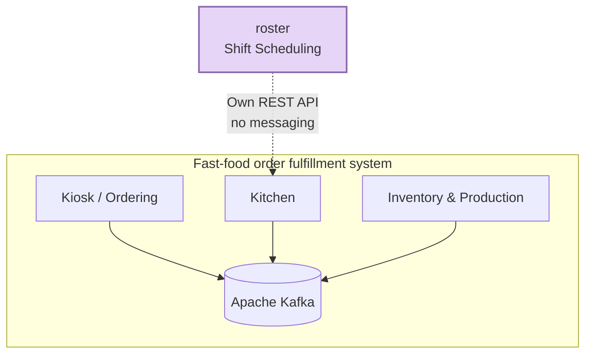
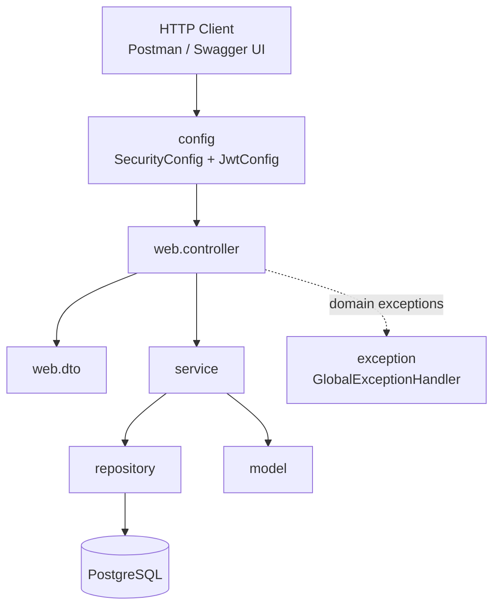
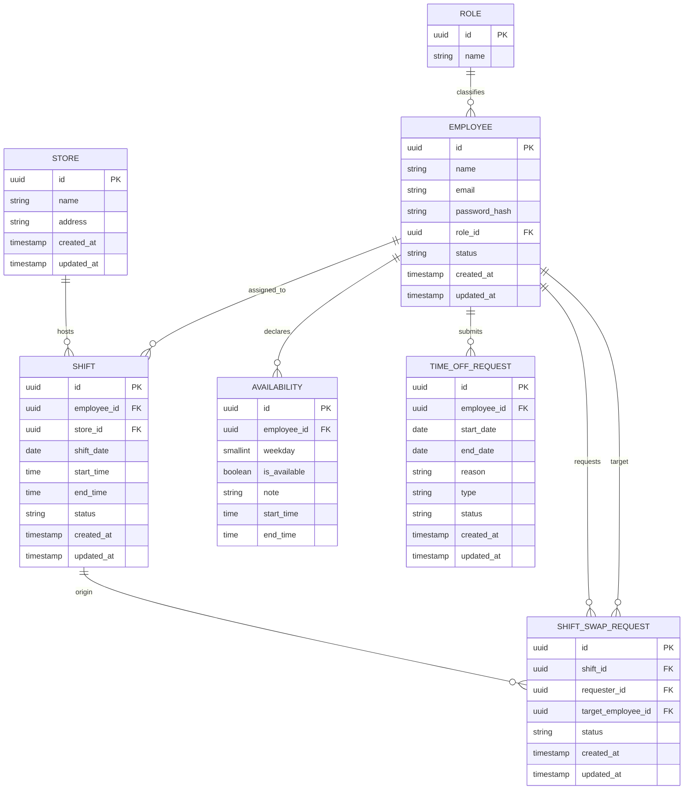
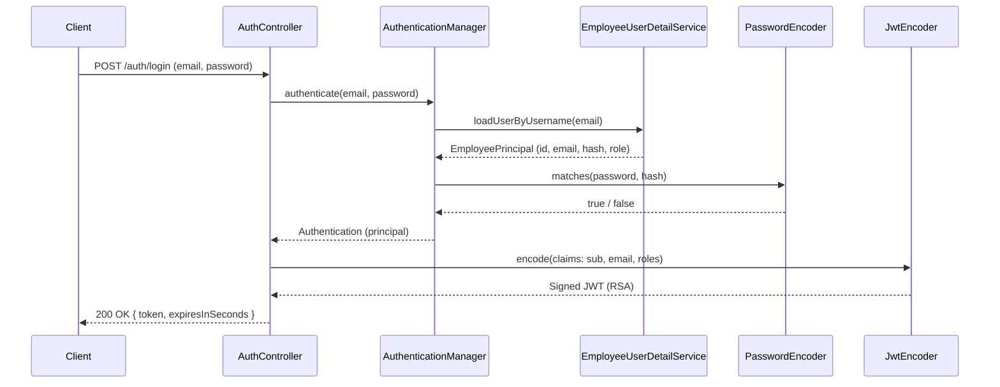

# roster

Employee shift scheduling service — part of a fast-food-style order fulfillment system, made up of independent microservices: kiosk/ordering, kitchen, inventory/production, and this service, **roster**.

Unlike the other services in the ecosystem, **roster is standalone**: it neither publishes nor consumes events via Kafka. This is a deliberate architectural decision — employee scheduling doesn't participate in the real-time order/kitchen/inventory transactional flow, so there's no reason to couple it to the messaging layer. Any future integration with another service (e.g. "who's currently on shift") would be done via a direct synchronous REST call to this service.

## Tech stack

| Layer | Technology |
|---|---|
| Language | Java 25 |
| Framework | Spring Boot 4.1.0 / Spring Security 7 |
| Persistence | Spring Data JPA + PostgreSQL 16 |
| Migrations | Flyway (`spring-boot-starter-flyway`) |
| Authentication | OAuth2 Resource Server + self-issued JWT (in-memory RSA via Nimbus) |
| Documentation | springdoc-openapi 3.0.2 (Swagger UI) |
| Testing | JUnit 5, Mockito, Testcontainers (Postgres), `@WebMvcTest` |
| Boilerplate | Lombok |

> Naming note: the correct security starter for this version is `spring-boot-starter-security-oauth2-resource-server`. The older name, `spring-boot-starter-oauth2-resource-server`, has been deprecated as of Boot 4 in favor of this one.

## Architecture

### Where roster sits in the ecosystem



### Layered architecture (internal to the service)



Standard request flow: the `Controller` receives and validates the DTO (`@Valid`), delegates to the `Service` (business logic), which talks to the `Repository` (JPA). Domain exceptions (`ObjectNotFoundException`, `ObjectConflictException`) bubble up untreated and are caught centrally by the `GlobalExceptionHandler`, never by `try/catch` scattered across controllers.

## Data model



Note that `EMPLOYEE` has no `store_id` — an employee doesn't belong to a fixed store. The link between employee and store originates from `SHIFT`, since a person can be scheduled at more than one location.

## Authentication



The service issues its own tokens (there is no external Authorization Server). The RSA key pair is generated in memory at startup (`JwtConfig.rsaKeyPair()`) — simple enough for this stage of the project, with the trade-off that every restart invalidates previously issued tokens.

## Code conventions

### Package structure

```
com.ficsolution.roster/
├── annotation/          # custom validation annotations (@ValidPassword)
├── validator/           # ConstraintValidator implementations
├── config/              # SecurityConfig, JwtConfig, SwaggerConfig
├── exception/           # domain exceptions + GlobalExceptionHandler
├── model/               # JPA entities
│   └── enumModel/       # domain enums (EmployeeStatus, ShiftStatus...)
├── repository/          # JpaRepository interfaces
├── service/             # business logic
└── web/
    ├── controller/      # REST controllers, thin
    └── dto/
        ├── auth/        # LoginRequest, LoginResponse
        └── role/        # RoleRequest, RoleResponse
```

Every new entity follows the same pattern: DTOs live in `web/dto/<entity>/`, never inside the entity's own file.

### DTO conventions

- No `DTO` suffix in the name — `RoleRequest`, not `RoleDTO`.
- A single `XRequest` covers both creation and update when the fields don't diverge (the case of `RoleRequest`). Split into `CreateXRequest`/`UpdateXRequest` only when the rules genuinely differ between the two flows.
- Always a `record`, never a class.
- `XResponse.from(entity)` — static factory method for Entity → DTO.
- `XRequest.toEntity()` — instance method for DTO → Entity, **only when construction is a direct field copy**, with no dependency on a repository or another bean. As soon as assembly requires fetching something from the database or applying a rule (e.g. `EmployeeService.createEmployee`, which resolves `Role` and hashes the password), that logic belongs in the `service`, not in the DTO.

### Dependency injection

Adopted pattern: **constructor injection** via `@RequiredArgsConstructor` (Lombok), `private final` field. Correct reference: `RoleService`, `EmployeeUserDetailService`.

### Domain exceptions

Two generic exceptions, parameterized by data rather than by type:

- `ObjectNotFoundException(String resourceName, String identifier)` → 404
- `ObjectConflictException(String resourceName, String reason)` → 409

This avoids the explosion of one class per entity (`EmployeeNotFoundException`, `RoleNotFoundException`, ...) when the behavior is identical and only the data changes. Handled centrally by `GlobalExceptionHandler`, which responds with `ProblemDetail` (RFC 7807).

### Validation

Bean Validation on the DTOs (`@NotBlank`, `@Email`, `@Size`). Password rule via a custom annotation: `@ValidPassword` (minimum 12 characters, focused on length rather than low-value complexity rules).

### IDs

Adopted pattern: `@GeneratedValue(strategy = GenerationType.UUID)` — correct reference: `Role`. See the technical debt section below: the other entities don't yet follow this pattern.

### Tests

- **Repository**: `@DataJpaTest` + Testcontainers (real Postgres), never H2 or mocks.
- **Service**: plain JUnit 5 + Mockito, no Spring context.
- **Controller**: `@WebMvcTest` + `@MockitoBean` (the old `@MockBean` was removed in Boot 4 — watch out to import from `org.springframework.test.context.bean.override.mockito`, not `org.springframework.boot.test.mock.mockito`). Requires the `spring-boot-starter-webmvc-test` dependency, separate from `spring-boot-starter-test` since Boot 4's modularization.

## Implemented endpoints

| Method | Route | Authentication |
|---|---|---|
| POST | `/auth/login` | Public |
| POST | `/roles` | Authenticated |
| GET | `/roles` | Authenticated |
| GET | `/roles/{id}` | Authenticated |
| PUT | `/roles/{id}` | Authenticated |
| DELETE | `/roles/{id}` | Authenticated |

`Employee`, `Store`, `Shift`, `Availability`, `TimeOffRequest`, and `ShiftSwapRequest` already have `model`, `repository`, `service`, and repository/service tests in place — only the `web` layer (DTOs + controller) for each is still missing.

## Running locally

Prerequisites: JDK 25, Docker.

```bash
docker compose up -d          # starts Postgres (roster_db, postgres/postgres, port 5432)
./mvnw spring-boot:run        # applies Flyway migrations automatically and starts the app
```

The API comes up at `http://localhost:8080`. Swagger UI at `/swagger-ui.html`, OpenAPI spec at `/v3/api-docs`.
