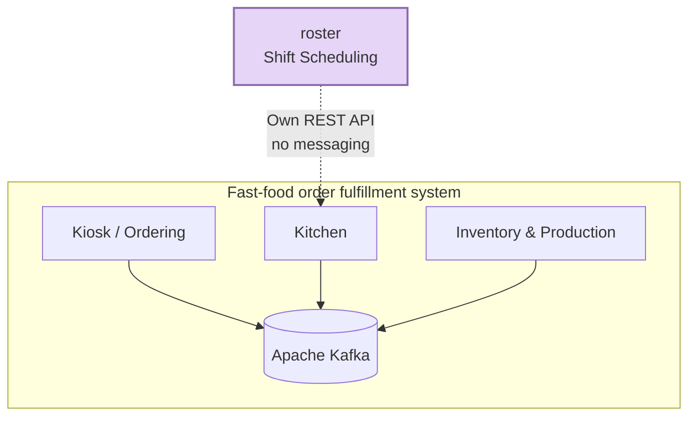
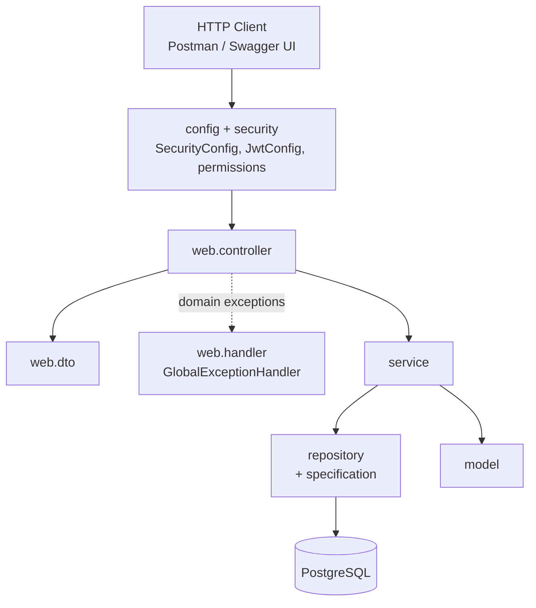
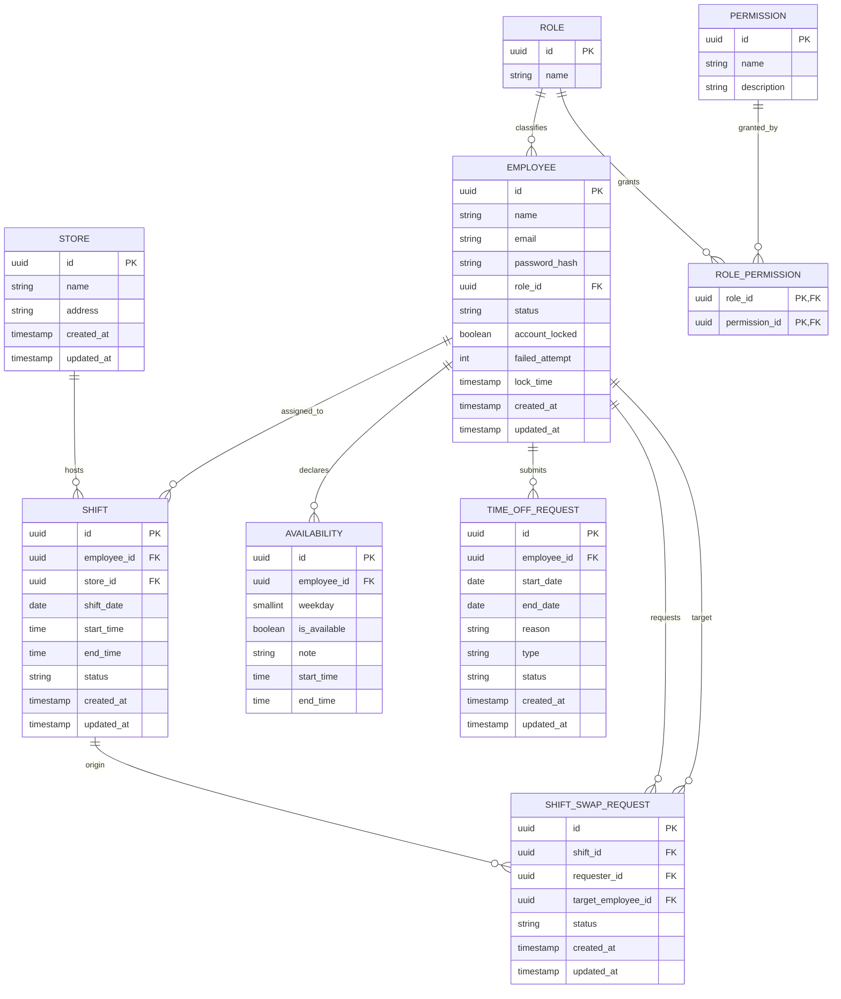
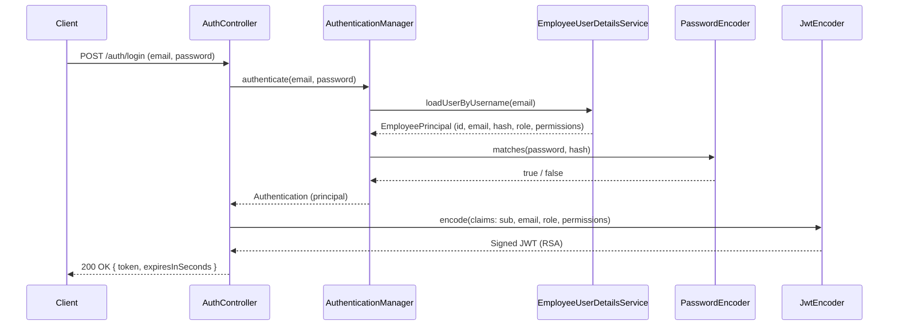

# roster

Employee shift scheduling service — part of a fast-food-style order fulfillment system, made up of independent microservices: kiosk/ordering, kitchen, inventory/production, and this service, **roster**.

Unlike the other services in the ecosystem, **roster is standalone**: it neither publishes nor consumes events via Kafka. This is a deliberate architectural decision — employee scheduling doesn't participate in the real-time order/kitchen/inventory transactional flow, so there's no reason to couple it to the messaging layer. Any future integration with another service (e.g. "who's currently on shift") would be done via a direct synchronous REST call to this service.

## Tech stack

| Layer | Technology |
|---|---|
| Language | Java 25 |
| Framework | Spring Boot 4.1.0 / Spring Security 7 |
| Persistence | Spring Data JPA + PostgreSQL 16 |
| Migrations | Flyway (`spring-boot-starter-flyway`) |
| Authentication | OAuth2 Resource Server + self-issued JWT (in-memory RSA via Nimbus) |
| Authorization | Permission-based access control, permissions stored in the database |
| Documentation | springdoc-openapi 3.0.2 (Swagger UI) |
| Testing | JUnit 5, Mockito, Testcontainers (Postgres), `@WebMvcTest` |
| Boilerplate | Lombok |

> Naming note: the correct security starter for this version is `spring-boot-starter-security-oauth2-resource-server`. The older name, `spring-boot-starter-oauth2-resource-server`, has been deprecated as of Boot 4 in favor of this one.

## Architecture

### Where roster sits in the ecosystem



### Layered architecture (internal to the service)



Standard request flow: the `Controller` receives and validates the DTO (`@Valid`), delegates to the `Service` (business logic), which talks to the `Repository` (JPA). Domain exceptions (`ObjectNotFoundException`, `ObjectConflictException`) and `AccessDeniedException` bubble up untreated and are caught centrally by `web.handler.GlobalExceptionHandler`, never by `try/catch` scattered across controllers.

## Data model



Note that `EMPLOYEE` has no `store_id` — an employee doesn't belong to a fixed store. The link between employee and store originates from `SHIFT`, since a person can be scheduled at more than one location.

Migrations (`src/main/resources/db/migration`):

| Version | Content |
|---|---|
| V1 | Schema (store, role, employee, shift, availability, time_off_request, shift_swap_request) |
| V2 | Seed data (stores, roles `MANAGER`/`SUPERVISOR`/`STAFF`, employees, shifts...) |
| V3 | Account lockout columns on `employee` |
| V4 | `permission` + `role_permission` tables, seeded with the default grants per role |

## Authentication



- The service issues its own tokens (there is no external Authorization Server). The RSA key pair is generated in memory at startup (`JwtConfig.rsaKeyPair()`) — simple enough for this stage of the project, with the trade-off that every restart invalidates previously issued tokens.
- Tokens are valid for 1 hour. `sub` is the employee id; `permissions` becomes the request's authorities (no `ROLE_` prefix); `role` is informational only and is never used for authorization.
- **Account lockout**: `security.AuthenticationEventListener` listens to Spring Security's authentication events. Each bad password increments `failed_attempt`; at 3 consecutive failures the account is locked (`account_locked = true`, `lock_time` recorded). A successful login resets the counter. There is currently no automatic unlock.
- Only `ACTIVE` employees can log in.

## Authorization

Access is **permission-based**: every rule checks a permission, never a role name. A role is just a named group of permissions, stored in `role_permission`, so a new role created via `/roles` becomes usable by assigning permissions to it — no code change needed.

Rules are enforced in two places:

1. **URL gate** — `config.SecurityConfig` (`hasAuthority` / `hasAnyAuthority`).
2. **Ownership** — in the controllers, via `security.SecurityUtil.requireOwnershipOrPermission(ownerId, X_ANY)`: the caller must own the resource or hold the `*_ANY` permission.

Naming convention: `X_SELF` lets the employee act on their own data; `X_ANY` lets them act on anyone's data. Permission names live in `security.Permissions` and must match the rows seeded in V4.

Default grants (V4 seed):

| Permission | MANAGER | SUPERVISOR | STAFF |
|---|:-:|:-:|:-:|
| `ROLE_MANAGE` | ✓ | | |
| `STORE_READ` | ✓ | ✓ | ✓ |
| `STORE_WRITE` | ✓ | | |
| `EMPLOYEE_READ_SELF` | ✓ | ✓ | ✓ |
| `EMPLOYEE_READ_ANY` | ✓ | ✓ | |
| `EMPLOYEE_WRITE` | ✓ | | |
| `EMPLOYEE_PASSWORD_SELF` | ✓ | ✓ | ✓ |
| `EMPLOYEE_PASSWORD_ANY` | ✓ | | |
| `SHIFT_READ` | ✓ | ✓ | ✓ |
| `SHIFT_WRITE` | ✓ | ✓ | |
| `SWAP_REQUEST_SELF` | ✓ | ✓ | ✓ |
| `SWAP_REQUEST_ANY` | ✓ | ✓ | |
| `TIME_OFF_SELF` | ✓ | ✓ | ✓ |
| `TIME_OFF_ANY` | ✓ | ✓ | |
| `TIME_OFF_REVIEW` | ✓ | ✓ | |
| `AVAILABILITY_SELF` | ✓ | ✓ | ✓ |
| `AVAILABILITY_ANY` | ✓ | ✓ | |

Grants can be changed at runtime with `PUT /roles/{id}/permissions` (replaces the role's whole set). Because permissions are embedded in the JWT, a change only takes effect for a user at their next login.

## Implemented endpoints

| Method | Route | Required permission |
|---|---|---|
| POST | `/auth/login` | Public |
| POST / GET / PUT / DELETE | `/roles`, `/roles/{id}` | `ROLE_MANAGE` |
| GET / PUT | `/roles/{id}/permissions` | `ROLE_MANAGE` |
| GET | `/permissions` | `ROLE_MANAGE` |
| GET | `/stores`, `/stores/{id}` | `STORE_READ` |
| POST / PUT / DELETE | `/stores`, `/stores/{id}` | `STORE_WRITE` |
| POST | `/employees` | `EMPLOYEE_WRITE` |
| GET | `/employees` (paged; filters `roleId`, `name`, `email`, `status`) | `EMPLOYEE_READ_ANY` |
| GET | `/employees?email=` | `EMPLOYEE_READ_ANY` |
| GET | `/employees/{id}` | own: `EMPLOYEE_READ_SELF` · others: `EMPLOYEE_READ_ANY` |
| PUT | `/employees/{id}`, `/employees/{id}/change-status` | `EMPLOYEE_WRITE` |
| PUT | `/employees/{id}/change-password` | own: `EMPLOYEE_PASSWORD_SELF` · others: `EMPLOYEE_PASSWORD_ANY` |
| GET | `/shifts` (filters `employeeId`, `storeId`, `start`, `end`), `/shifts/{id}` | `SHIFT_READ` |
| POST / PUT | `/shifts`, `/shifts/{id}` | `SHIFT_WRITE` |
| POST | `/shifts/{id}/swap-requests` | requester is self: `SWAP_REQUEST_SELF` · otherwise: `SWAP_REQUEST_ANY` |
| GET | `/swap-requests/{id}` | requester or target: `SWAP_REQUEST_SELF` · otherwise: `SWAP_REQUEST_ANY` |
| PUT | `/swap-requests/{id}` | only the swap's **target** (logged employee, validated in the service) |
| DELETE | `/swap-requests/{id}` | requester: `SWAP_REQUEST_SELF` · otherwise: `SWAP_REQUEST_ANY` |
| POST | `/time-off-requests` | own: `TIME_OFF_SELF` · others: `TIME_OFF_ANY` |
| GET | `/time-off-requests` | `TIME_OFF_ANY` |
| GET | `/time-off-requests?employeeId=`, `/time-off-requests/{id}` | own: `TIME_OFF_SELF` · others: `TIME_OFF_ANY` |
| PUT | `/time-off-requests/{id}` | `TIME_OFF_REVIEW` |
| DELETE | `/time-off-requests/{id}` | own: `TIME_OFF_SELF` · others: `TIME_OFF_ANY` |
| POST | `/availabilities` | own: `AVAILABILITY_SELF` · others: `AVAILABILITY_ANY` |
| GET | `/availabilities` | `AVAILABILITY_ANY` |
| GET / PUT / DELETE | `/availabilities?employeeId=`, `/availabilities/{id}` | own: `AVAILABILITY_SELF` · others: `AVAILABILITY_ANY` |

Error responses use `ProblemDetail` (RFC 7807): 400 validation, 401 unauthenticated, 403 missing permission / not the owner, 404 not found, 409 conflict (e.g. changing a swap or time-off request that is no longer `PENDING`).

## Code conventions

### Package structure

```
com.ficsolution.roster/
├── config/                  # SecurityConfig, JwtConfig, SwaggerConfig
├── exception/               # domain exceptions (ObjectNotFoundException, ObjectConflictException)
├── model/                   # JPA entities
│   └── enums/               # domain enums (EmployeeStatus, ShiftStatus...)
├── repository/              # JpaRepository interfaces
│   └── specification/       # JPA Specifications for filtered queries
├── security/                # Permissions, SecurityUtil, EmployeePrincipal,
│                            # EmployeeUserDetailsService, AuthenticationEventListener
├── service/                 # business logic
├── validation/              # @ValidPassword + PasswordValidator
└── web/
    ├── controller/          # REST controllers, thin
    ├── handler/             # GlobalExceptionHandler (@RestControllerAdvice)
    └── dto/
        ├── auth/  availability/  common/  employee/  permission/
        └── role/  shift/  store/  timeoff/
```

Every new entity follows the same pattern: DTOs live in `web/dto/<entity>/`, never inside the entity's own file. Tests mirror the main packages (`repository`, `service`, `web/controller`).

### DTO conventions

- No `DTO` suffix in the name — `RoleRequest`, not `RoleDTO`.
- A single `XRequest` covers both creation and update when the fields don't diverge (the case of `RoleRequest`). Split into `CreateXRequest`/`UpdateXRequest` only when the rules genuinely differ between the two flows.
- Always a `record`, never a class.
- `XResponse.from(entity)` — static factory method for Entity → DTO.
- `XRequest.toEntity()` — instance method for DTO → Entity, **only when construction is a direct field copy**, with no dependency on a repository or another bean. As soon as assembly requires fetching something from the database or applying a rule (e.g. `EmployeeService.createEmployee`, which resolves `Role` and hashes the password), that logic belongs in the `service`, not in the DTO.
- Never trust the body for "who is acting": the acting employee comes from the token (`SecurityUtil.currentEmployeeId()`), e.g. `UpdateShiftSwap` carries only `status`.

### Dependency injection

Adopted pattern: **constructor injection** via `@RequiredArgsConstructor` (Lombok), `private final` field. Correct reference: `RoleService`, `EmployeeUserDetailsService`.

### Domain exceptions

Two generic exceptions, parameterized by data rather than by type:

- `ObjectNotFoundException(String resourceName, String identifier)` → 404
- `ObjectConflictException(String resourceName, String reason)` → 409

This avoids the explosion of one class per entity (`EmployeeNotFoundException`, `RoleNotFoundException`, ...) when the behavior is identical and only the data changes. Handled centrally by `web.handler.GlobalExceptionHandler`, which responds with `ProblemDetail` (RFC 7807). Authorization failures raised in controllers or services use Spring Security's `AccessDeniedException` → 403.

### Validation

Bean Validation on the DTOs (`@NotBlank`, `@Email`, `@Size`). Password rule via a custom annotation: `@ValidPassword` (minimum 12 characters, focused on length rather than low-value complexity rules).

### IDs

All entities use `@GeneratedValue(strategy = GenerationType.UUID)`, with `DEFAULT gen_random_uuid()` on the database side.

### Tests

- **Repository**: `@DataJpaTest` + Testcontainers (real Postgres), never H2 or mocks. Uses the same Flyway migrations as the app (`src/main/resources/db/migration`) — there are no test-only migrations.
- **Service**: plain JUnit 5 + Mockito, no Spring context.
- **Controller**: `@WebMvcTest` + `@MockitoBean` (the old `@MockBean` was removed in Boot 4 — watch out to import from `org.springframework.test.context.bean.override.mockito`, not `org.springframework.boot.test.mock.mockito`). Requires the `spring-boot-starter-webmvc-test` dependency, separate from `spring-boot-starter-test` since Boot 4's modularization.
- **Security in controller tests**: `util.Util` provides JWTs whose authorities mirror the V4 seed (`authority` = manager, `supervisorAuthority`, `staffAuthority`...) and `Util.authorities(...)` to build a token with an arbitrary set of permissions. Keep `MANAGER_PERMISSIONS` / `SUPERVISOR_PERMISSIONS` / `STAFF_PERMISSIONS` in sync with the seed.

```bash
./mvnw clean test    # full suite; Docker must be running for Testcontainers
```

## Running locally

Prerequisites: JDK 25, Docker.

```bash
docker compose up -d          # starts Postgres (roster_db, postgres/postgres, port 5432)
./mvnw spring-boot:run        # applies Flyway migrations automatically and starts the app
```

The API comes up at `http://localhost:8080`. Swagger UI at `/swagger-ui.html`, OpenAPI spec at `/v3/api-docs`.

## Known limitations

- **Seed passwords are placeholders**: the employees seeded in V2 have dummy `password_hash` values, so nobody can log in on a fresh database. Set a real BCrypt hash for a `MANAGER` employee directly in the database to bootstrap.
- **In-memory RSA key**: restarting the app invalidates all issued tokens.
- **No automatic unlock**: an account locked after 3 failed logins stays locked; `lock_time` is recorded but not used yet.
- **Permission changes are not immediate**: they apply at the user's next login (tokens last 1 hour).
