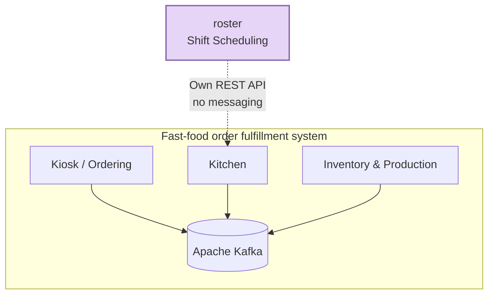
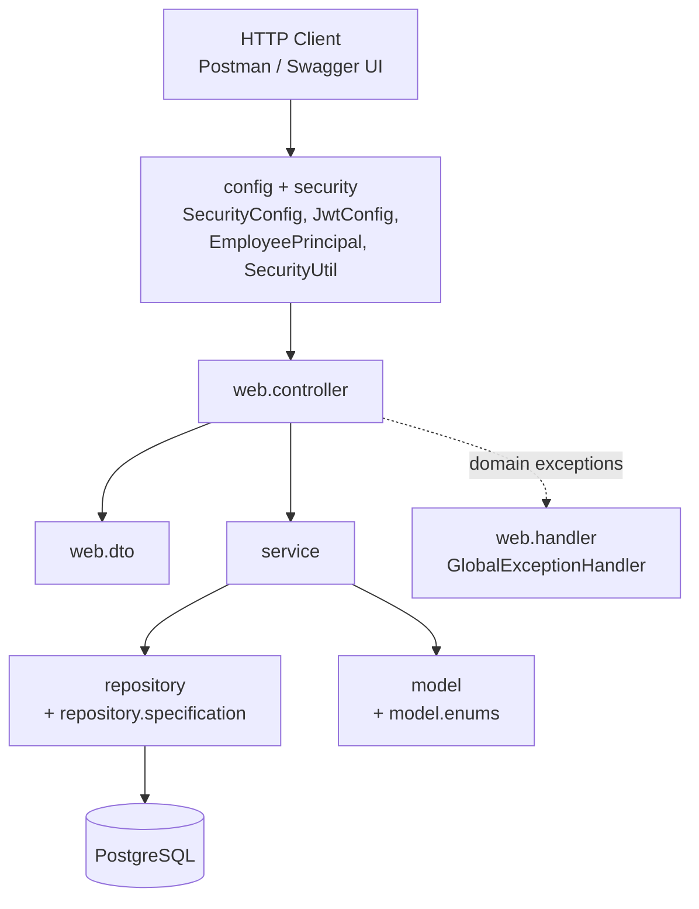
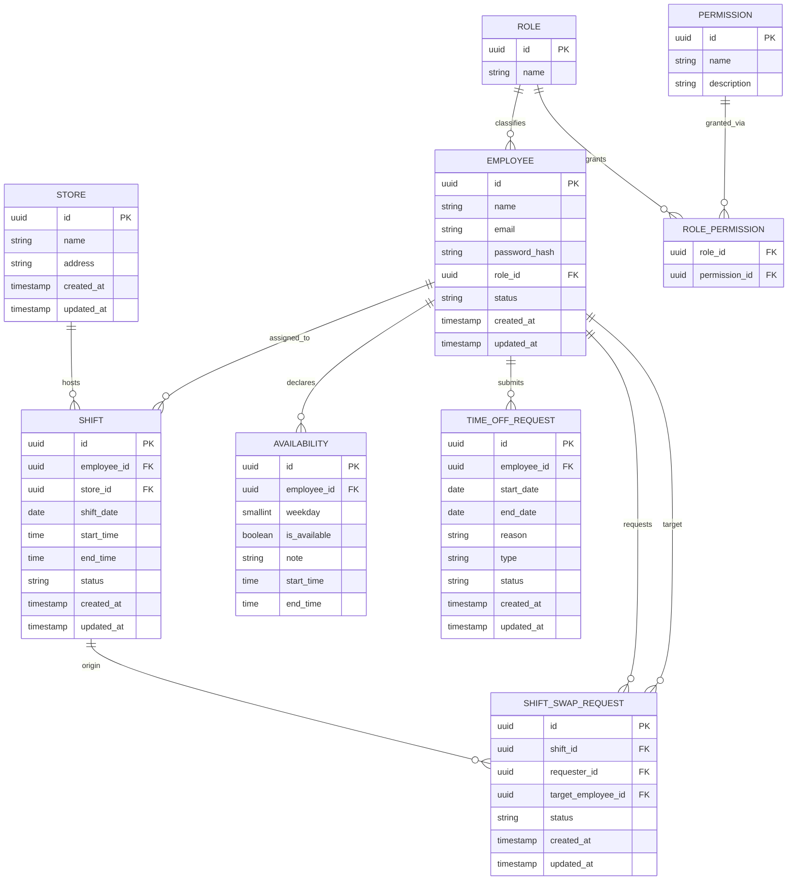
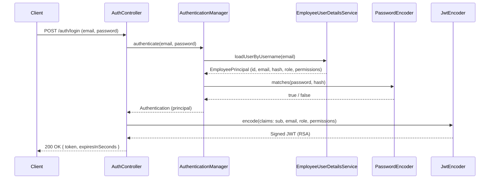

# roster

Employee shift scheduling service — part of a fast-food-style order fulfillment system, made up of independent microservices: kiosk/ordering, kitchen, inventory/production, and this service, **roster**.

Unlike the other services in the ecosystem, **roster is standalone**: it neither publishes nor consumes events via Kafka. This is a deliberate architectural decision — employee scheduling doesn't participate in the real-time order/kitchen/inventory transactional flow, so there's no reason to couple it to the messaging layer. Any future integration with another service (e.g. "who's currently on shift") would be done via a direct synchronous REST call to this service.

## Tech stack

| Layer | Technology |
|---|---|
| Language | Java 25 |
| Framework | Spring Boot 4.1.0 / Spring Security 7 |
| Persistence | Spring Data JPA + PostgreSQL 16 |
| Migrations | Flyway (`spring-boot-starter-flyway`) |
| Authentication | OAuth2 Resource Server + self-issued JWT (in-memory RSA via Nimbus) |
| Authorization | Permission-based RBAC (roles are just named permission sets, resolved at runtime) |
| Observability | Spring Boot Actuator |
| Documentation | springdoc-openapi 3.0.2 (Swagger UI) |
| Testing | JUnit 5, Mockito, Testcontainers (Postgres), `@WebMvcTest` |
| Boilerplate | Lombok |

> Naming note: the correct security starter for this version is `spring-boot-starter-security-oauth2-resource-server`. The older name, `spring-boot-starter-oauth2-resource-server`, has been deprecated as of Boot 4 in favor of this one.

## Architecture

### Where roster sits in the ecosystem



### Layered architecture (internal to the service)



Standard request flow: `SecurityConfig` gates the request by permission at the route level, the `Controller` receives and validates the DTO (`@Valid`), optionally enforces ownership via `SecurityUtil` (see [Authorization model](#authorization-model)), and delegates to the `Service` (business logic), which talks to the `Repository` (JPA). Domain exceptions (`ObjectNotFoundException`, `ObjectConflictException`, `AccessDeniedException`) bubble up untreated and are caught centrally by the `GlobalExceptionHandler`, never by `try/catch` scattered across controllers.

## Data model



Note that `EMPLOYEE` has no `store_id` — an employee doesn't belong to a fixed store. The link between employee and store originates from `SHIFT`, since a person can be scheduled at more than one location.

`ROLE` doesn't hardcode behavior: it's just a name attached to a set of `PERMISSION`s through `ROLE_PERMISSION`. Seeded roles (`MANAGER`, `SUPERVISOR`, `STAFF`) are a starting point, not a fixed enum — see below.

## Authentication



The service issues its own tokens (there is no external Authorization Server). The RSA key pair is generated in memory at startup (`JwtConfig.rsaKeyPair()`) — simple enough for this stage of the project, with the trade-off that every restart invalidates previously issued tokens.

`EmployeePrincipal` resolves `employee.getRole().getPermissions()` **inside** `loadUserByUsername`'s transaction and copies the permission names into a plain `Set<String>` — the JPA-managed `Role`/`Permission` entities never leak outside that transaction, which is what avoids `LazyInitializationException` down the line.

## Authorization model

Authorization is **permission-based**, not role-based: the API never checks `hasRole("MANAGER")` anywhere. Instead:

1. Each `Role` is just a name attached to a set of `Permission`s (`MANAGER`, `SUPERVISOR`, `STAFF` today, seeded in `V4__permissions.sql`).
2. On login, the employee's permission names are copied into the JWT as a `permissions` claim (e.g. `["STORE_READ", "SHIFT_READ", "TIME_OFF_SELF"]`).
3. `SecurityConfig` gates every route by permission (`hasAuthority(Permissions.STORE_READ)`), never by role name.
4. Adding a new role, or changing what an existing role can do, is a **data change** — `POST /roles` + `PUT /roles/{id}/permissions` — not a code change or a redeploy.

Many permissions come in `_SELF` / `_ANY` pairs (e.g. `TIME_OFF_SELF`, `TIME_OFF_ANY`). The route matcher only confirms the caller holds *one of the two* — it can't know, at the routing level, whether the record in the URL/body actually belongs to the caller. That check happens in the controller, via `SecurityUtil`:

```java
// caller must own employeeId, unless they hold the "_ANY" permission
SecurityUtil.requireOwnershipOrPermission(employeeId, Permissions.TIME_OFF_ANY);
```

`SecurityUtil.currentEmployeeId()` reads the caller's identity from the JWT `sub` claim — request bodies are never trusted to say who's calling. That distinction mattered in practice: an earlier version of `PUT /swap-requests/{id}` took the acting employee's id from the request body, which meant a caller could claim to be the swap's target. The fix removed that field from the DTO entirely; the acting identity now always comes from `SecurityUtil.currentEmployeeId()`, and the service re-validates it against the swap request's real `target`.

**Known trade-off**: permissions are baked into the JWT at login time. If a `MANAGER` changes a role's permissions mid-flight, employees already holding a token keep their old permission set until it expires (1 hour) or they log in again. Acceptable for this project's scale; a production system with tighter requirements would need either short-lived tokens with refresh, or a permission lookup on each request instead of trusting the token's claim.

### Use case diagram


`Manager` is modeled as a specialization of `Any User` (UML actor generalization) — it inherits every self-service use case (checking a shift, requesting a swap, declaring availability, requesting time off) and adds the administrative ones (managing roles/permissions, stores, employees). This mirrors the permission model above: a `MANAGER` role is simply seeded with every permission a `STAFF` has, plus the administrative ones — the diagram and the `role_permission` table describe the same boundary from two angles.

## Code conventions

### Package structure

```
com.ficsolution.roster/
├── config/              # SecurityConfig, JwtConfig, SwaggerConfig
├── security/            # EmployeePrincipal, EmployeeUserDetailsService, SecurityUtil, Permissions
├── validation/          # @ValidPassword + its ConstraintValidator
├── exception/           # domain exceptions (ObjectNotFoundException, ObjectConflictException)
├── model/               # JPA entities
│   └── enums/           # domain enums (EmployeeStatus, ShiftStatus, RequestStatus, TimeOffRequestType)
├── repository/           # JpaRepository interfaces
│   └── specification/   # Specification<T> filters (EmployeeSpecification, ShiftSpecification)
├── service/             # business logic
└── web/
    ├── controller/      # REST controllers, thin
    ├── handler/         # GlobalExceptionHandler (ProblemDetail / RFC 7807)
    └── dto/
        ├── auth/        # LoginRequest, LoginResponse
        ├── employee/    # ...Employee request/response DTOs
        ├── permission/  # PermissionResponse, RolePermissionsRequest
        ├── role/        # RoleRequest, RoleResponse
        ├── shift/        # ...
        ├── timeoff/      # ...
        ├── availability/ # ...
        └── common/       # PagedResponse and other shared shapes
```

Every new entity follows the same pattern: DTOs live in `web/dto/<entity>/`, never inside the entity's own file.

### DTO conventions

- No `DTO` suffix in the name — `RoleRequest`, not `RoleDTO`.
- A single `XRequest` covers both creation and update when the fields don't diverge. Split into `CreateXRequest`/`UpdateXRequest` only when the rules genuinely differ between the two flows.
- Always a `record`, never a class.
- `XResponse.from(entity)` — static factory method for Entity → DTO.
- `XRequest.toEntity()` — instance method for DTO → Entity, **only when construction is a direct field copy**, with no dependency on a repository or another bean. As soon as assembly requires fetching something from the database or applying a rule (e.g. `EmployeeService.createEmployee`, which resolves `Role` and hashes the password), that logic belongs in the `service`, not in the DTO.

### Dependency injection

Adopted pattern: **constructor injection** via `@RequiredArgsConstructor` (Lombok), `private final` field.

### Domain exceptions

Two generic exceptions, parameterized by data rather than by type:

- `ObjectNotFoundException(String resourceName, String identifier)` → 404
- `ObjectConflictException(String resourceName, String reason)` → 409
- Spring Security's `AccessDeniedException` → 403 (mapped centrally alongside the two above)

This avoids the explosion of one class per entity (`EmployeeNotFoundException`, `RoleNotFoundException`, ...) when the behavior is identical and only the data changes. Handled centrally by `GlobalExceptionHandler`, which responds with `ProblemDetail` (RFC 7807).

### Validation

Bean Validation on the DTOs (`@NotBlank`, `@Email`, `@Size`). Password rule via a custom annotation: `@ValidPassword` (minimum 12 characters, focused on length rather than low-value complexity rules).

### IDs

`@GeneratedValue(strategy = GenerationType.UUID)` on every entity.

### JPA entities

`@Getter`/`@Setter` only — never Lombok's `@Data` on an entity. `@Data` generates `equals()`/`hashCode()`/`toString()` that touch every field, including lazy associations, which is exactly what triggers `LazyInitializationException` once the entity leaves its transaction (this bit us twice early on, on the `Employee → Role` association).

### Tests

- **Repository**: `@DataJpaTest` + Testcontainers (real Postgres), never H2 or mocks.
- **Service**: plain JUnit 5 + Mockito, no Spring context.
- **Controller**: `@WebMvcTest` + `@MockitoBean` (the old `@MockBean` was removed in Boot 4 — watch out to import from `org.springframework.test.context.bean.override.mockito`, not `org.springframework.boot.test.mock.mockito`). Requires the `spring-boot-starter-webmvc-test` dependency, separate from `spring-boot-starter-test` since Boot 4's modularization. Authorization tests use dedicated JWT post-processors per permission set (`Util.staffAuthority`, `Util.supervisorAuthority`, ...), each with a real `sub` claim, so ownership checks are actually exercised — not just role gating.

## Implemented endpoints

| Method | Route | Required permission |
|---|---|---|
| POST | `/auth/login` | Public |
| POST | `/roles` | `ROLE_MANAGE` |
| GET | `/roles` | `ROLE_MANAGE` |
| GET | `/roles/{id}` | `ROLE_MANAGE` |
| PUT | `/roles/{id}` | `ROLE_MANAGE` |
| DELETE | `/roles/{id}` | `ROLE_MANAGE` |
| GET | `/roles/{id}/permissions` | `ROLE_MANAGE` |
| PUT | `/roles/{id}/permissions` | `ROLE_MANAGE` |
| GET | `/permissions` | `ROLE_MANAGE` |
| POST | `/stores` | `STORE_WRITE` |
| GET | `/stores`, `/stores/{id}` | `STORE_READ` |
| PUT | `/stores/{id}` | `STORE_WRITE` |
| DELETE | `/stores/{id}` | `STORE_WRITE` |
| POST | `/employees` | `EMPLOYEE_WRITE` |
| GET | `/employees` (list, and lookup by `?email=`) | `EMPLOYEE_READ_ANY` |
| GET | `/employees/{id}` | `EMPLOYEE_READ_SELF` (own id) or `EMPLOYEE_READ_ANY` |
| PUT | `/employees/{id}` | `EMPLOYEE_WRITE` |
| PUT | `/employees/{id}/change-status` | `EMPLOYEE_WRITE` |
| PUT | `/employees/{id}/change-password` | `EMPLOYEE_PASSWORD_SELF` (own id) or `EMPLOYEE_PASSWORD_ANY` |
| POST | `/shifts` | `SHIFT_WRITE` |
| GET | `/shifts`, `/shifts/{id}` | `SHIFT_READ` |
| PUT | `/shifts/{id}` | `SHIFT_WRITE` |
| POST | `/shifts/{id}/swap-requests` | `SWAP_REQUEST_SELF` (requester) or `SWAP_REQUEST_ANY` |
| GET | `/swap-requests/{id}` | `SWAP_REQUEST_SELF` (requester or target) or `SWAP_REQUEST_ANY` |
| PUT | `/swap-requests/{id}` | Route open to `SWAP_REQUEST_SELF`/`SWAP_REQUEST_ANY`; service enforces that only the swap's real `target` may approve/reject |
| DELETE | `/swap-requests/{id}` | `SWAP_REQUEST_SELF` (requester) or `SWAP_REQUEST_ANY` |
| POST | `/time-off-requests` | `TIME_OFF_SELF` (own id) or `TIME_OFF_ANY` |
| GET | `/time-off-requests` (list all) | `TIME_OFF_ANY` |
| GET | `/time-off-requests?employeeId=` | `TIME_OFF_SELF` (own id) or `TIME_OFF_ANY` |
| GET | `/time-off-requests/{id}` | `TIME_OFF_SELF` (own id) or `TIME_OFF_ANY` |
| PUT | `/time-off-requests/{id}` | `TIME_OFF_REVIEW` (approve/reject) |
| DELETE | `/time-off-requests/{id}` | `TIME_OFF_SELF` (own id) or `TIME_OFF_ANY` |
| POST | `/availabilities` | `AVAILABILITY_SELF` (own id) or `AVAILABILITY_ANY` |
| GET | `/availabilities` (list all) | `AVAILABILITY_ANY` |
| GET | `/availabilities?employeeId=`, `/availabilities/{id}` | `AVAILABILITY_SELF` (own id) or `AVAILABILITY_ANY` |
| PUT | `/availabilities/{id}` | `AVAILABILITY_SELF` (own id) or `AVAILABILITY_ANY` |
| DELETE | `/availabilities/{id}` | `AVAILABILITY_SELF` (own id) or `AVAILABILITY_ANY` |

All routes above except `/auth/login` also require a valid, non-expired JWT (`Authorization: Bearer <token>`).

## Running locally

Prerequisites: JDK 25, Docker.

```bash
docker compose up -d          # starts Postgres (roster_db, postgres/postgres, port 5432)
./mvnw spring-boot:run        # applies Flyway migrations automatically and starts the app
```

The API comes up at `http://localhost:8080`. Swagger UI at `/swagger-ui.html`, OpenAPI spec at `/v3/api-docs`. Actuator health at `/actuator/health`.
